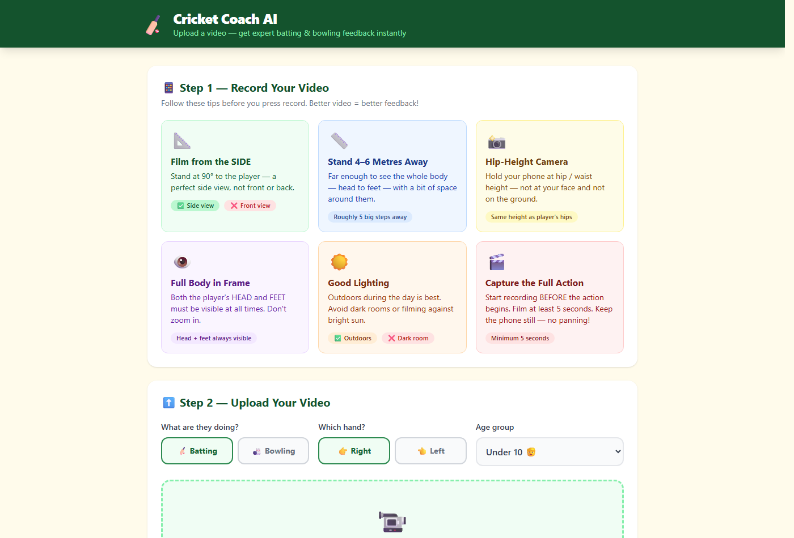
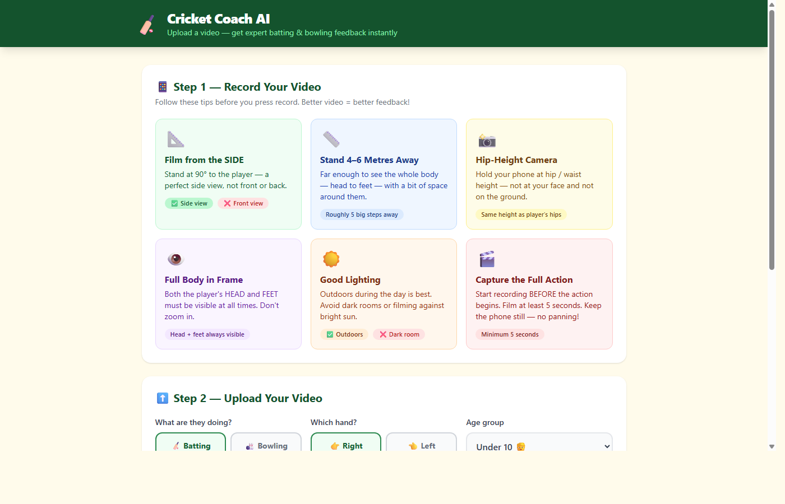

# 🏏 Cricket Coach AI

> **AI-powered cricket technique analyser** — upload a video, get instant pose-based feedback with angle overlays, smart auto-pause, and frame-level coaching. No subscription. No coach required.

---

## 📸 Screenshots

### Home — Upload Page


### Step 1: Record Tips + Step 2: Upload Form
The app walks you through exactly how to film your video for best results, then lets you configure mode, handedness and age group before uploading.



> **Results page** — after uploading a video, the AI analyses every frame and surfaces the Top 3 issues with:
> - 📐 Angle arc drawn on the exact frame (e.g. `"Front knee: 138° — COLLAPSING"`)
> - ⏸ Auto-pause at the issue moment with a **▶ Continue in slow-mo** button
> - 🟠 Fading orange trail tracing the problem joint through the motion
> - 📋 Coaching cards with what's wrong, why it matters, how to fix it, and a drill

---

## ✨ Features

### 🎯 Core Analysis
| Feature | Detail |
|---|---|
| **Batting analysis** | Stance width, knee bend, backlift angle, follow-through, head position, balance |
| **Bowling analysis** | Front knee collapse, bowling arm height, guide arm extension, shoulder turn, head tilt, follow-through |
| **Handedness support** | Full left-hand and right-hand analysis with correct joint mapping |
| **Age group thresholds** | Under 10 / Under 15 / Under 18 / Adult — angles and tolerances adjust accordingly |
| **Top 3 issues** | Ranked by severity — not a wall of text, just what matters most |

### 📐 Video Coaching Overlay
| Feature | Detail |
|---|---|
| **Auto-pause at issue moment** | Video plays from 2.5 s before the problem, pauses at the exact frame |
| **Angle arc on canvas** | Orange arc drawn at the problem joint (e.g. knee, elbow) with the measured degree value |
| **On-video label badge** | Red banner: `"Front knee: 138° — COLLAPSING at landing (needs 155–175°)"` |
| **Focus ring** | Pulsing red circle highlights the exact joint to watch |
| **Fading movement trail** | Orange dots trace the joint's path during slow-mo playback (last 18 positions) |
| **Live arc during playback** | Angle arc updates in real time as the joint moves |

### 🎮 Viewer Controls
| Control | What It Does |
|---|---|
| **▶ Continue in slow-mo** | Resumes at 0.25× speed after auto-pause |
| **Speed buttons** | 0.25× / 0.5× / 1× playback |
| **Auto-zoom** | Viewer zooms to the problem joint automatically |
| **Loop toggle** | Loop on/off for repetitive study |
| **Reset** | Returns to full-speed video from the beginning |

### 📋 Per-Issue Coaching Cards
Each detected issue includes:
- ❌ **What's wrong** — plain-English description
- ⚠️ **Why it matters** — impact on performance or injury risk
- ✅ **How to fix it** — actionable technique cue
- 🏋️ **Drill** — specific practice exercise to correct it

### ⚙️ Processing
| Feature | Detail |
|---|---|
| **Video trimming** | Set start/end trim times before uploading |
| **Background processing** | Analysis runs in a background thread; progress bar shown |
| **Formats supported** | MP4, MOV, AVI, MKV |
| **Max file size** | 500 MB |
| **Model auto-download** | MediaPipe pose model (~5 MB) downloaded automatically on first run |

---

## 🔬 What Gets Analysed

### 🏏 Batting Checks
| Check | What It Measures |
|---|---|
| **Stance Width** | Hip-to-ankle distance vs. shoulder width — too narrow or too wide |
| **Knee Bend** | Front knee angle at impact — should be 150–165° (slight flex, not locked/collapsed) |
| **Backlift** | Wrist height relative to shoulder at top of backlift |
| **Follow Through** | Arm extension completing the shot |
| **Head Position** | Head tilt angle — should stay still and level |
| **Balance** | Hip symmetry during the shot |

### 🎳 Bowling Checks
| Check | What It Measures |
|---|---|
| **Front Knee** | Knee angle at front-foot landing — collapsing below 155° causes back injury |
| **Bowling Arm Height** | Wrist height relative to head at release — below head = round-arm action |
| **Guide Arm** | Non-bowling arm elbow extension — needs 160°+ to drive shoulder rotation |
| **Shoulder Turn** | Hip-to-shoulder angle — needs to be side-on (≥70°) at delivery |
| **Head Position** | Head tilt during delivery stride — causes wides if tilted |
| **Follow Through** | Whether the bowler runs through the crease or stops dead |

---

## 🚀 Getting Started

### Prerequisites
- Python 3.9 or higher
- pip
- A cricket video (batting or bowling, filmed from side-on)

### Installation

**Option 1 — One-click (Windows)**
```
double-click install.bat
double-click start.bat
```

**Option 2 — One-click (Mac/Linux)**
```bash
chmod +x install.sh start.sh
./install.sh
./start.sh
```

**Option 3 — Manual**
```bash
pip install -r requirements.txt
python app.py
```

Then open **http://localhost:5000** in your browser.

> The MediaPipe pose model (~5 MB) downloads automatically on first run.

### Best Results — Filming Tips
- 📹 Film from the **side** (perpendicular to the crease/pitch direction)
- 🌅 Good lighting — avoid strong backlight
- 👤 Full body in frame throughout the shot/delivery
- 📱 Landscape orientation preferred
- ⏱ 5–30 second clips work best

---

## 🛠️ Tech Stack

| Layer | Technology |
|---|---|
| **Backend** | Python 3, Flask |
| **Pose Estimation** | Google MediaPipe Pose Landmarker (Lite model) |
| **Video Processing** | OpenCV (cv2) |
| **Maths** | NumPy |
| **Frontend** | HTML5, Tailwind CSS, Vanilla JavaScript |
| **Canvas Overlays** | HTML5 Canvas API |
| **Concurrency** | Python threading (background analysis jobs) |

---

## ✅ Pros

| Pro | Why It Matters |
|---|---|
| **100% free & local** | No subscription, no cloud, no data sent anywhere — your videos stay on your machine |
| **Works offline** | After the model downloads once, zero internet needed |
| **Frame-accurate feedback** | Pauses at the *exact* frame the issue occurs, not a general summary |
| **Visual angle measurement** | You see the actual degrees on screen — not just "your knee is wrong" |
| **Separate rule sets** | Batting and bowling have completely different biomechanical standards |
| **Age-appropriate** | Thresholds differ for U10 kids vs adults — not one-size-fits-all |
| **Left & right handed** | Full mirroring of joint logic for left-handers |
| **Slow-mo trail** | The movement path of the problem joint is drawn — you see *how* it went wrong |
| **Drill suggestions** | Every issue comes with a practice drill, not just diagnosis |
| **Fast setup** | One command install, runs in your browser |

---

## ❌ Cons / Limitations

| Limitation | Detail |
|---|---|
| **Side-on video required** | Pose estimation accuracy drops significantly for front-on or angled footage |
| **Single player only** | Designed for one athlete in frame — multiple players confuse the pose detector |
| **No ball tracking** | The ball is not tracked — bat-ball contact timing is not analysed |
| **Lighting sensitive** | Poor lighting, heavy shadows, or bright backlighting reduces joint detection accuracy |
| **Rules are heuristic** | Angle thresholds are based on general coaching standards, not a player's personal biomechanics |
| **No wrist/hand detail** | MediaPipe Pose does not track individual fingers — grip analysis is not possible |
| **CPU intensive** | Processing a 30s video takes 30–90 seconds depending on machine (no GPU acceleration) |
| **No real-time mode** | Analysis is offline only — no live webcam coaching (yet) |
| **English only** | All feedback text is in English |
| **Local only** | No sharing, no team dashboard, no history saved between sessions |
| **Clip quality matters** | Compressed, low-res, or shaky video produces less reliable results |

---

## 📁 Project Structure

```
CricketApp/
├── app.py                    # Flask server & job management
├── requirements.txt          # Python dependencies
├── analysis/
│   ├── video_processor.py    # Frame extraction, pose detection, result assembly
│   ├── batting_rules.py      # All batting technique checks
│   ├── bowling_rules.py      # All bowling technique checks
│   └── pose_detector.py      # MediaPipe wrapper, skeleton drawing, angle maths
├── templates/
│   ├── index.html            # Upload page
│   └── results.html          # Coaching results & video viewer
├── static/
│   ├── css/style.css         # Custom styles
│   └── js/
│       ├── app.js            # Upload flow, progress bar
│       └── results.js        # Video viewer, canvas overlays, angle arcs, trail
├── docs/
│   └── screenshots/          # App screenshots for README
├── uploads/                  # Temporary uploaded videos (git-ignored)
└── results/                  # Generated annotated videos (git-ignored)
```

---

## 🗺️ Roadmap / Possible Improvements

- [ ] Real-time webcam mode (live coaching feedback)
- [ ] GPU acceleration for faster processing
- [ ] PDF coaching report export
- [ ] Session history (save and compare multiple videos)
- [ ] Multi-angle support (front-on + side-on combined)
- [ ] More batting shots (hook, sweep, cut)
- [ ] Wicketkeeping mode
- [ ] Fielding technique (throwing action)

---

## 🤝 Contributing

Pull requests are welcome. For major changes, please open an issue first to discuss what you'd like to change.

---

## 📄 Licence

MIT — free to use, modify, and distribute.

---

*Built with 🏏 and too much coffee.*
